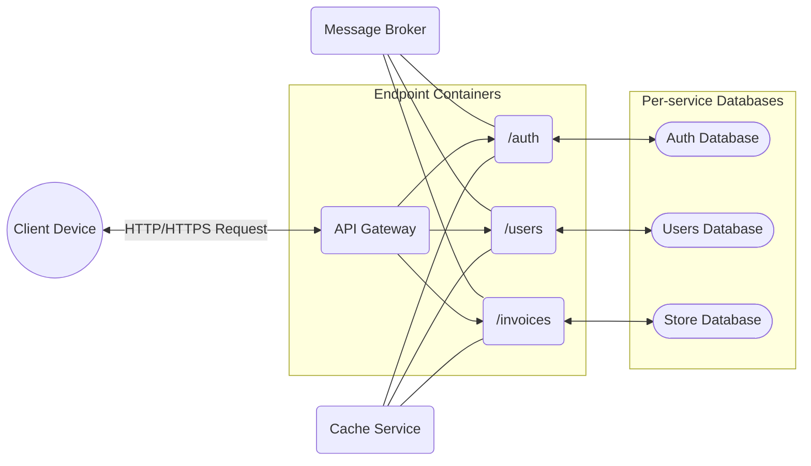

<p align="center">
  
</p>

NestedAPI: My Experimental Backend Sandbox Project

## About the Project
NestedAPI is a microservices-based framework designed for creating backend services that cater to real-world needs. Please note that this project is purely experimental and meant for personal exploration. It is not intended for commercial or production use. 

## Why I Started This Project
I embarked on this journey to streamline the development cycle and enhance collaboration within my team. The goal is to focus solely on essential components during development. While the core of this project is built using Kotlin, I encourage the freedom to introduce modules in different programming languages as long as they integrate seamlessly with existing technologies. I'm committed to refining these modules to ensure they fulfill their respective purposes effectively.

## How the Project Operates
NestedAPI transforms RESTful API endpoints into specialized components, enabling scalable architecture to handle substantial workloads. Let me illustrate the project's composition:



The diagram showcases the service structure. Each service can have replicas that collaborate harmoniously. This synergy is facilitated by the API gateway, serving as both a load balancer and a messaging service that relies on RabbitMQ's pub/sub model. Modules are dedicated to specific tasks, and if one module requires access to another's information, it produces a message consumed by the relevant service.

As for the database, each module only interacts with the tables pertinent to its tasks, maintaining data isolation. This ensures that information is solely managed by the responsible module.

## Getting Started
If you're interested in exploring and experimenting with this project on your local machine, follow these steps. Remember, this project is not intended for deployment in live systems.

### Prerequisites
You'll need a Linux host with Docker support, along with the docker-compose utility to deploy project containers.

### Installation
Deploy the project using Docker Compose:
> ```
> [dummy@dummy-world NestedApi]$ docker-compose -f docker-compose.yml up -d
> ```

## Technologies Utilized
* BSON Encoding - Serialization of RPC requests in binary format.
* RabbitMQ - Internal bus for RPC communication between services.
* Docker - Containerization of project and dependencies.
* JWT Parser - Generation and validation of stateless user tokens.
* H2 Database - Embedded SQL database for testing entity operations.
* Microsoft SQL - High-performance database supporting all modules.
* Hibernate & JPA - Persistence of entities in the database without hardcoded SQL.
* Quarkus Framework - Execution of code and native builds for module projects.

## Contributions
For details on our code of conduct and the process of submitting pull requests, please refer to [CONTRIBUTING.md](./CONTRIBUTING.md).

## License
This project is licensed under the MIT License. For more information, view the [LICENSE](./LICENSE) file.
